# NFTConnect-iOS
NFTConnect-iOS is written in Swift that utilizes data from [Alchemy](https://www.alchemy.com/) & [OpenSea Testnets](https://testnets.opensea.io/).

## Setup

## Architecture

### MVVM-C

```mermaid
flowchart TD
    subgraph API Service
        viewModels["`NFTListViewModel NFTDetailViewModel`"]
        APIHandler --> NFTRepository
        NFTRepository --> NFTDataStore
        NFTDataStore --> viewModels
    end
    subgraph Detail Scene
        NFTDetailViewProvider -- View State Closure --> NFTDetailViewController
        NFTDetailViewModel -- ViewModel State Closure --> NFTDetailViewController
    end
    subgraph List Scene
        NFTListCollectionViewProvider -- View State Closure --> NFTListViewController
        NFTListViewModel -- ViewModel State Closure --> NFTListViewController
    end
    subgraph Coordinator
        AppDelegate --> NFTListCoordinator
        NFTListCoordinator --> NFTDetailCoordinator
        NFTDetailCoordinator --> OpenWeb
    end
```

## Design patterns

## Contribute

### Pull request

Pull request are more than welcome! If you do submit one, please make sure to use a descriptive title and description.
